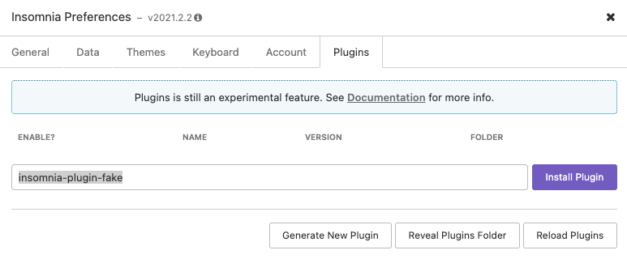
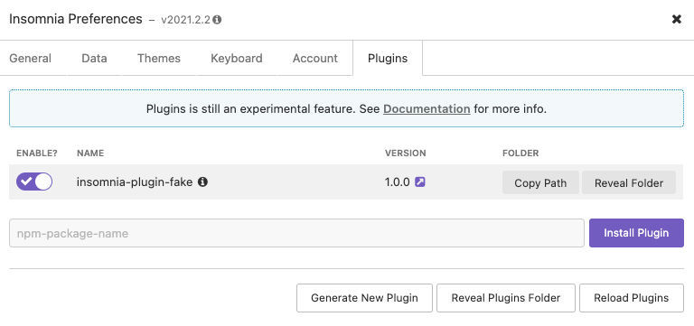
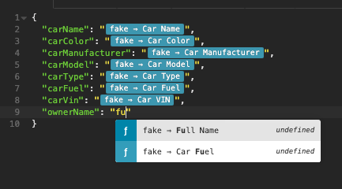

# insomnia-plugin-fake

Insomnia plugin to create fake data

Fake data generation using https://github.com/marak/Faker.js/

Install insomnia rest client from https://insomnia.rest/download

For Mac `brew install --cask insomnia`

---

## How to install

> Goto: `Insomnia Preferences -> Plugins`

#### npm package name: `insomnia-plugin-fake`


#### Enable the plugin


#### `Ctrl+Space` for auto-completion in the request body



> Some fake data... Happy testing the APIs 😃
```json
{
  "carName": "Maserati LeBaron",
  "carColor": "red",
  "carManufacturer": "Volvo",
  "carModel": "Aventador",
  "carType": "Minivan",
  "carFuel": "Hybrid",
  "carVin": "FF8SZD81P6UX92654",
  "ownerName": "Kelley Russel"
}
```

#### Available keys are

```java
// Address
Zip Code
City
City Name
Street Name
Street Address
Secondary Address
County
Country Name
Country Code
State
Latitude
Longitude
Time Zone

// Commerce
Department
Product Name
Price
Adjective
Product Material
Product
Product Description

// Color
Color Code
Color Name

// Company
Company Name

// Datatype
Int
Float
String
UUID
Boolean
Hexa Decimal

// Date and Time
Month
Weekday
Unix Time
Unix Time (now)
Time (milliseconds)
Time (now milliseconds)
Date (yyyy-mm-dd)
Date (yyyy/mm/dd)
Date today(yyyy-mm-dd)
Date today(yyyy/mm/dd)
DateTime ISO-8601
DateTime ISO-8601 (now)
Month Code
Weekday Code

// Finance
Bank Account Number
Bank Account Name
Bank Routing Number
Bank Transaction Amount
Bank Transaction Type
Currency Code
Currency Name
Currency Symbol
Bitcoin Address
Litecoin Address
Credit Card Number
Credit Card CVV
Ethereum Address
IBAN
BIC
Bank Transaction Desc

// Image URLs
Random Image URL
Avatar URL
Image URL

// Internet
Email
Example Email
User Name
Protocol
HTTP Method
URL
Domain Name
Domain Suffix
Domain Word
IP
IPv6
Application Port
User Agent
Mac Address
Password

// Lorem
Lorem Word
Lorem Words
Lorem Sentence
Lorem Slug
Lorem Sentences
Lorem Paragraph
Lorem Paragraphs
Lorem Text
Lorem Lines

// Name
First Name
Last Name
Middle Name
Full Name
Job Title
Gender
Prefix
Suffix
Title
Job Desc
Job Area
Job Type

// Phone
Phone Number
Phone Number Local

// Developer
File Name
Mime Type
File Type
File Ext
File Type
Directory Path
File Path
Semver


// Car
Car Name
Car Color
Car Manufacturer
Car Model
Car Type
Car Fuel
Car VIN
```
